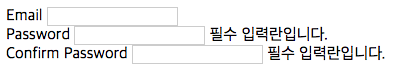
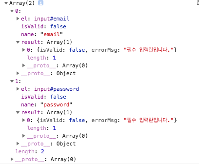

FormValidator
=============

> 폼 유효성 검사 라이브러리.

<br>
Useage
=========

<div>
  
</div>

```javascript
var formValidator = new FormValidator("#form");

formValidator
  .addValidation("required", (value) => !!value, "필수 입력란입니다.");

formValidator
  .addTarget("email", ["required"])
  .addTarget("password", ["required"]);

formValidator.validate();
```
<br>
Method
======

### `addTarget(name[String], validations[ Array[String] ])`
```javascript
formValidator.addTarget("email", ["required", "email"]);
```
- Form 내부에서 유효성 검사를 할 태그와 validationType을 추가.

<br>

### `removeTarget(name[String])`
```javascript
formValidator.removeTarget("email");
```
- addTarget으로 추가된 태그를 제거.

<br>

### `addValidation(type[String], matcher[Function|Regexp], errorMsg[String])`
```javascript
formValidator.addValidation("required", (value) => !!value, "필수 입력란입니다.");

// or

formValidator.addValidation("number", /\d/, "숫자만 입력가능합니다.");
```
- Validation 추가.

<br>

### `removeValidation[type[String])`
```javascript
formValidator.addValidation("required");
formValidator.addValidation("number");
```
- Validation 삭제.

<br>

### `setErrorMsg[tagName[String], attributes[Object], styles[Object])`
```javascript
formValidator.setErrorMsg(
  "email", 
  { className: 'email' }, 
  { color: '#f00' }
);
```
- addTarget으로 추가된 태그의 ErrorMsg 속성 및 스타일 설정.

<br>

### `setErrorMsgPosition[name[String], target[Selector|Element]]`
```javascript
formValidator.setErrorMsgPosition('email', '.password-confirm-box');

// or

formValidator.setErrorMsgPosition('email', document.querySelector('.password-confirm-box'));
```
- Validation 삭제

<br>

### `result(Void)`
```javascript
formValidator.result();
```
- addTarget으로 지정해 놓은 태그들의 유효성 검사 결과를 반환.

<div>
  
</div>

### `validate(Void)`
```javascript
formValidator.validate();
```
- addTarget으로 지정해 놓은 태그들의 유효성 검사를 하고 실패하면 errorMsg를 append시킨다.
- 유효성 검사 결과를 반환.
